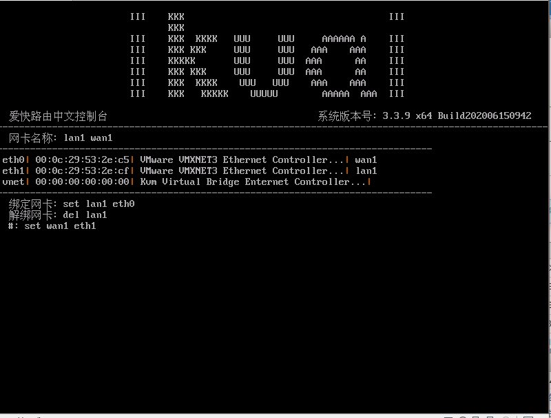
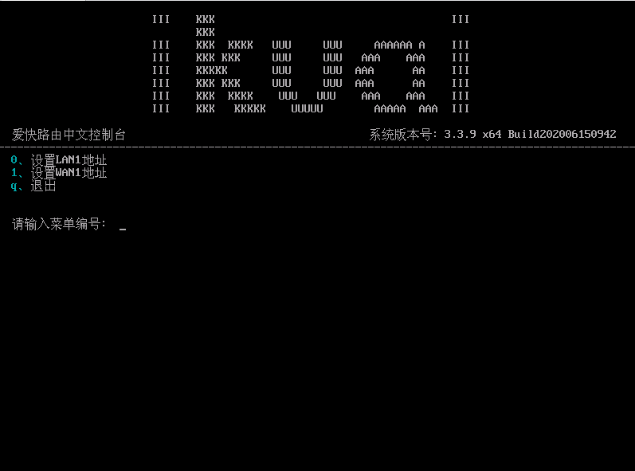

---
title: IKUAI软路由系统公网IP设置
tags: 新建,模板,小书匠

slug: storywriter/grammar
grammar_abbr: true
grammar_table: true
grammar_defList: true
grammar_emoji: true
grammar_footnote: true
grammar_ins: true
grammar_mark: true
grammar_sub: true
grammar_sup: true
grammar_checkbox: true
grammar_mathjax: true
grammar_flow: true
grammar_sequence: true
grammar_plot: true
grammar_code: true
grammar_highlight: true
grammar_html: true
grammar_linkify: true
grammar_typographer: true
grammar_video: true
grammar_audio: true
grammar_attachment: true
grammar_mermaid: true
grammar_classy: true
grammar_cjkEmphasis: true
grammar_cjkRuby: true
grammar_center: true
grammar_align: true
grammar_tableExtra: true
--- 


#### 1. 连接后台
连接服务器显示器，进入后台操作

#### 2. 设定绑定网卡
【如不确定是那块网卡，将其余网口网线及尾纤全部拔掉，只留外网网口的网线或尾纤】
##### 2.1 按1绑定网卡

如果需要删除原绑定的LAN1或WAN1口则使用

```bash
del lan1 #删除LAN1口绑定
del wan1 #删除WAN1口绑定
```

##### set wan1 ethn 绑定WAN口
```bash
set wan1 ethn eth>>**n**<< >>**n**<<为需要绑定的外网口端口号
```

##### 按Q返回主菜单
#### 3 设置WAN口地址
##### 3.1 按2设置LAN/WAN地址

##### 3.2 按1设置WAN1地址
例如外网固定IP地址为： 120.121.122.123/255.255.255.252
网关为：120.121.122.122

输入网关

按Q返回主菜单
#### 4 测试外网是否连通
##### 4.1 输入4 Ping测试

输入外网网关测试是否可以Ping通网关
