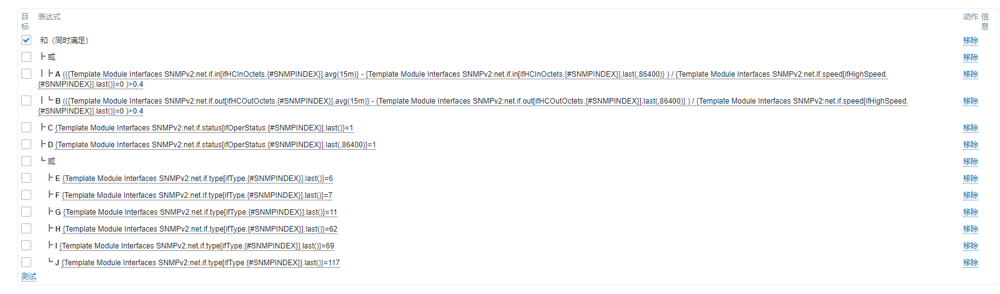
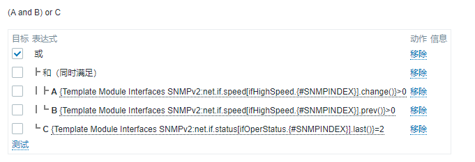

#### 1. 端口流量超过40%报警
```
Interface {#IFNAME}({#IFALIAS}):  is greater than 4G a day ago
```
* 报警逻辑：
 ( 最近15分钟的流量平均值-最后一天流量的平均值) / 当前端口设定流量 >0.4
 

 
 ```
 ((({Template Module Interfaces SNMPv2:net.if.in[ifHCInOctets.{#SNMPINDEX}].avg(15m)}
-
{Template Module Interfaces SNMPv2:net.if.in[ifHCInOctets.{#SNMPINDEX}].last(,86400)}
)
/
{Template Module Interfaces SNMPv2:net.if.speed[ifHighSpeed.{#SNMPINDEX}].last()}=0
)>0.4
or
(({Template Module Interfaces SNMPv2:net.if.out[ifHCOutOctets.{#SNMPINDEX}].avg(15m)}
-
{Template Module Interfaces SNMPv2:net.if.out[ifHCOutOctets.{#SNMPINDEX}].last(,86400)}
)
/
{Template Module Interfaces SNMPv2:net.if.speed[ifHighSpeed.{#SNMPINDEX}].last()}=0
)>0.4
)
and
{Template Module Interfaces SNMPv2:net.if.status[ifOperStatus.{#SNMPINDEX}].last()}=1
and
{Template Module Interfaces SNMPv2:net.if.status[ifOperStatus.{#SNMPINDEX}].last(,86400)}=1
and (
{Template Module Interfaces SNMPv2:net.if.type[ifType.{#SNMPINDEX}].last()}=6 or
{Template Module Interfaces SNMPv2:net.if.type[ifType.{#SNMPINDEX}].last()}=7 or
{Template Module Interfaces SNMPv2:net.if.type[ifType.{#SNMPINDEX}].last()}=11 or
{Template Module Interfaces SNMPv2:net.if.type[ifType.{#SNMPINDEX}].last()}=62 or
{Template Module Interfaces SNMPv2:net.if.type[ifType.{#SNMPINDEX}].last()}=69 or
{Template Module Interfaces SNMPv2:net.if.type[ifType.{#SNMPINDEX}].last()}=117
)
```
#### 2. 端口流量大于以前的值
```
Interface {#IFNAME}({#IFALIAS}): Ethernet has changed to lower speed than it was before
```

```
{Template Module Interfaces SNMPv2:net.if.speed[ifHighSpeed.{#SNMPINDEX}].change()}<0 and {Template Module Interfaces SNMPv2:net.if.speed[ifHighSpeed.{#SNMPINDEX}].last()}>0
and (
{Template Module Interfaces SNMPv2:net.if.type[ifType.{#SNMPINDEX}].last()}=6 or
{Template Module Interfaces SNMPv2:net.if.type[ifType.{#SNMPINDEX}].last()}=7 or
{Template Module Interfaces SNMPv2:net.if.type[ifType.{#SNMPINDEX}].last()}=11 or
{Template Module Interfaces SNMPv2:net.if.type[ifType.{#SNMPINDEX}].last()}=62 or
{Template Module Interfaces SNMPv2:net.if.type[ifType.{#SNMPINDEX}].last()}=69 or
{Template Module Interfaces SNMPv2:net.if.type[ifType.{#SNMPINDEX}].last()}=117
)
and
({Template Module Interfaces SNMPv2:net.if.status[ifOperStatus.{#SNMPINDEX}].last()}<>2)
```
恢复表达式
.
```
({Template Module Interfaces SNMPv2:net.if.speed[ifHighSpeed.{#SNMPINDEX}].change()}>0 and {Template Module Interfaces SNMPv2:net.if.speed[ifHighSpeed.{#SNMPINDEX}].prev()}>0) or
({Template Module Interfaces SNMPv2:net.if.status[ifOperStatus.{#SNMPINDEX}].last()}=2)
```